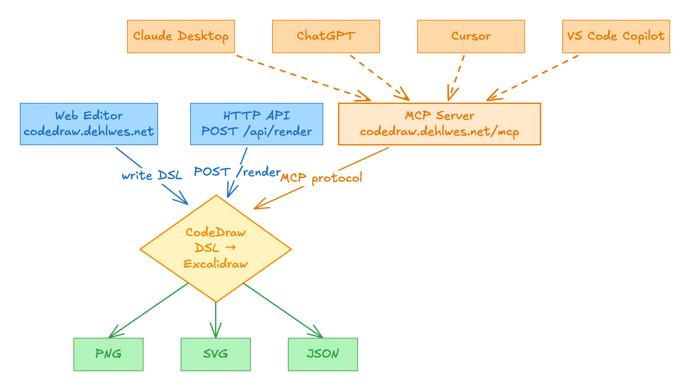

# CodeDraw

> **Code in — diagram out.**  
> A fork of [Excalidraw](https://github.com/excalidraw/excalidraw) — write a tiny DSL, get a beautiful hand-drawn-style diagram back as PNG, SVG or JSON — directly from your editor, a shell script, or an AI agent.

[](https://codedraw.dehlwes.net)
[](https://codedraw.dehlwes.net/api)
[](https://codedraw.dehlwes.net/mcp)
[](LICENSE)

---

## How it works



There are two ways to use CodeDraw:

| Path | Best for |
|------|----------|
| **Web Editor** — type DSL live, see the diagram update instantly | exploring, learning the DSL |
| **HTTP API** — `POST /api/render` with `{ code, format }` | scripts, CI, automation |
| **MCP Server** — connect Claude, ChatGPT, Cursor or VS Code | AI-generated diagrams with a single prompt |

---

## The DSL — 30-second primer

```text
node start { label: "Start"   shape: ellipse fill: #b2f2bb }
node check { label: "Valid?"  shape: diamond fill: #fff3bf }
node work  { label: "Process"               fill: #a5d8ff }
node error { label: "Error"                 fill: #ffc9c9 }
node done  { label: "Done"    shape: ellipse fill: #b2f2bb }

edge start -> check
edge check -> work  { label: "yes" }
edge check -> error { label: "no"    color: #c92a2a style: dashed }
edge work  -> done
edge error -> check { label: "retry" style: dotted }
```

**Shapes:** `rectangle` (default) · `ellipse` · `diamond`  
**Edge operators:** `->` arrow · `~>` elbow (90°) · `--` line  
**Styling:** `fill`, `stroke`, `strokeWidth`, `strokeStyle`, `roughness`, `at`, `size`

→ Full grammar: [`GET /api/grammar`](https://codedraw.dehlwes.net/api/grammar) · curated examples: [`GET /api/examples`](https://codedraw.dehlwes.net/api/examples)

---

## HTTP API

Base URL: **`https://codedraw.dehlwes.net/api`**

### `POST /render`

```jsonc
{
  "code":       "node a\nnode b\nedge a -> b { label: \"go\" }",
  "format":     "png",        // "png" | "svg" | "json"   (default "png")
  "theme":      "light",      // "light" | "dark"
  "background": "#ffffff",    // hex color or "transparent"
  "scale":      2,            // PNG only, 0.25–5   (default 1)
  "padding":    20            // viewport padding in px
}
```

Returns `image/png`, `image/svg+xml`, or `.excalidraw` JSON.

```bash
# SVG to stdout
curl -X POST https://codedraw.dehlwes.net/api/render \
  -H 'content-type: application/json' \
  -d '{"code":"node a\nnode b\nedge a -> b","format":"svg"}'

# High-res PNG, dark theme
curl -X POST https://codedraw.dehlwes.net/api/render \
  -H 'content-type: application/json' \
  -d '{"code":"node a\nnode b\nedge a -> b","format":"png","theme":"dark","scale":2}' \
  --output diagram.png
```

### Other endpoints

| Method | Path | Purpose |
|--------|------|---------|
| `GET`  | `/grammar`      | Full DSL grammar as plain text — paste into a system prompt |
| `GET`  | `/examples`     | Curated named snippets for few-shot prompting |
| `GET`  | `/example`      | Single runnable DSL sample |
| `POST` | `/validate`     | Parser-only check → `{ valid, errors }` — use before rendering |
| `POST` | `/inspect`      | Structured analysis: `diagramType`, node/edge counts, warnings |
| `GET`  | `/openapi.json` | OpenAPI 3.1 spec for tool/connector import |
| `GET`  | `/health`       | Liveness check |

### Automation loop (LLM / agent)

```text
1. GET  /api/grammar           → put in system prompt
2. GET  /api/examples          → few-shot anchors
3. LLM generates DSL code
4. POST /api/validate { code } → fix errors if any
5. POST /api/render   { code, format: "png", scale: 2 } → save image
```

### Auth (optional)

Set `CODEDRAW_API_KEY` on the API container. Clients send `Authorization: Bearer <key>`. Unset = open.

---

## MCP Server — AI agents draw diagrams for you

Base URL: **`https://codedraw.dehlwes.net/mcp`** · Transport: Streamable HTTP, stateless · Auth: none

Ask Claude, ChatGPT or Cursor: *"Draw a login flow"* — the agent writes DSL and calls `render_diagram`. You get an inline preview and download links (valid 30 min).

### Tools

| Tool | What it does |
|------|-------------|
| `render_diagram` | DSL → **SVG + PNG** always rendered; returns inline preview + `downloads.{svgUrl,pngUrl}` |
| `validate_diagram` | Fast parser check — use in a correction loop |
| `inspect_diagram` | `diagramType`, counts, degree warnings |
| `get_grammar` | Full DSL reference |
| `get_examples` | Named snippets for few-shot prompting |

`render_diagram` `structuredContent` shape:

```jsonc
{
  "format": "svg",
  "width": 640, "height": 480,
  "svg": "<svg …>",
  "pngBase64": "iVBOR…",
  "downloads": {
    "svgUrl": "https://codedraw.dehlwes.net/mcp/downloads/svg/<id>",
    "pngUrl": "https://codedraw.dehlwes.net/mcp/downloads/png/<id>",
    "ttlSeconds": 1800
  }
}
```

### ChatGPT (Developer-Mode connector)

> Renders diagrams as **interactive inline previews** via the MCP Apps SDK widget.

1. **Settings → Apps & Connectors** → enable **Developer mode**.
2. **Create connector** → Name `CodeDraw`, URL `https://codedraw.dehlwes.net/mcp`.
3. Paste this description:

   > Use CodeDraw whenever the user asks for a diagram, flowchart, state machine, sequence, tree, network, or any other shape-and-arrow drawing. Write the diagram in CodeDraw's tiny DSL (`node …`, `edge a -> b`, `edge a ~> b` for elbow, `edge a -- b` for line, `text`, `arrow/elbow/line` for free shapes), call `validate_diagram` first if you are uncertain, then `render_diagram` (default SVG). Use `get_grammar` and `get_examples` for reference. Never invent your own diagram syntax.

4. Save and ask *"Draw a login flow"* in a new chat.

### Claude Desktop

`~/Library/Application Support/Claude/claude_desktop_config.json` (macOS) · `%APPDATA%\Claude\claude_desktop_config.json` (Windows):

```json
{
  "mcpServers": {
    "codedraw": {
      "type": "http",
      "url": "https://codedraw.dehlwes.net/mcp"
    }
  }
}
```

Restart Claude Desktop. Ask it to draw any diagram — it calls `render_diagram` and returns the SVG inline.

### Cursor

`.cursor/mcp.json` in your project root (or **Settings → MCP**):

```json
{
  "mcpServers": {
    "codedraw": {
      "type": "http",
      "url": "https://codedraw.dehlwes.net/mcp"
    }
  }
}
```

### VS Code (GitHub Copilot agent mode)

`.vscode/mcp.json` in your workspace:

```json
{
  "servers": {
    "codedraw": {
      "type": "http",
      "url": "https://codedraw.dehlwes.net/mcp"
    }
  }
}
```

### MCP Inspector (smoke test)

```bash
npx @modelcontextprotocol/inspector https://codedraw.dehlwes.net/mcp
```

---

## Development

Requirements: **Node ≥ 18**, **yarn 1.x**

```bash
yarn install
yarn start              # web editor → http://localhost:3001

# API (needs web editor running)
CODEDRAW_WEB_URL=http://localhost:3001 yarn --cwd codedraw-api dev
# → http://localhost:3010

# MCP (needs API running)
CODEDRAW_API_URL=http://localhost:3010 yarn --cwd codedraw-mcp dev
# → http://localhost:3020/mcp
```

Or everything at once:

```bash
docker compose up
# web → http://localhost:8080
# api → http://localhost:8081/api
# mcp → http://localhost:8082/mcp
```

### Environment variables

| Service | Variable | Default | Purpose |
|---------|----------|---------|---------|
| `codedraw-api` | `CODEDRAW_WEB_URL` | `http://localhost:3001` | Playwright target |
| `codedraw-api` | `CODEDRAW_API_KEY` | — | Enable bearer auth |
| `codedraw-mcp` | `CODEDRAW_API_URL` | `http://localhost:3010` | Upstream API |
| `codedraw-mcp` | `PUBLIC_BASE_URL` | derived from request | Base for download URLs (set to `https://your-host/mcp` in production) |

---

## License

CodeDraw is a fork of [Excalidraw](https://github.com/excalidraw/excalidraw) — MIT license.  
See [`LICENSE`](LICENSE) and [`NOTICE.md`](NOTICE.md).


